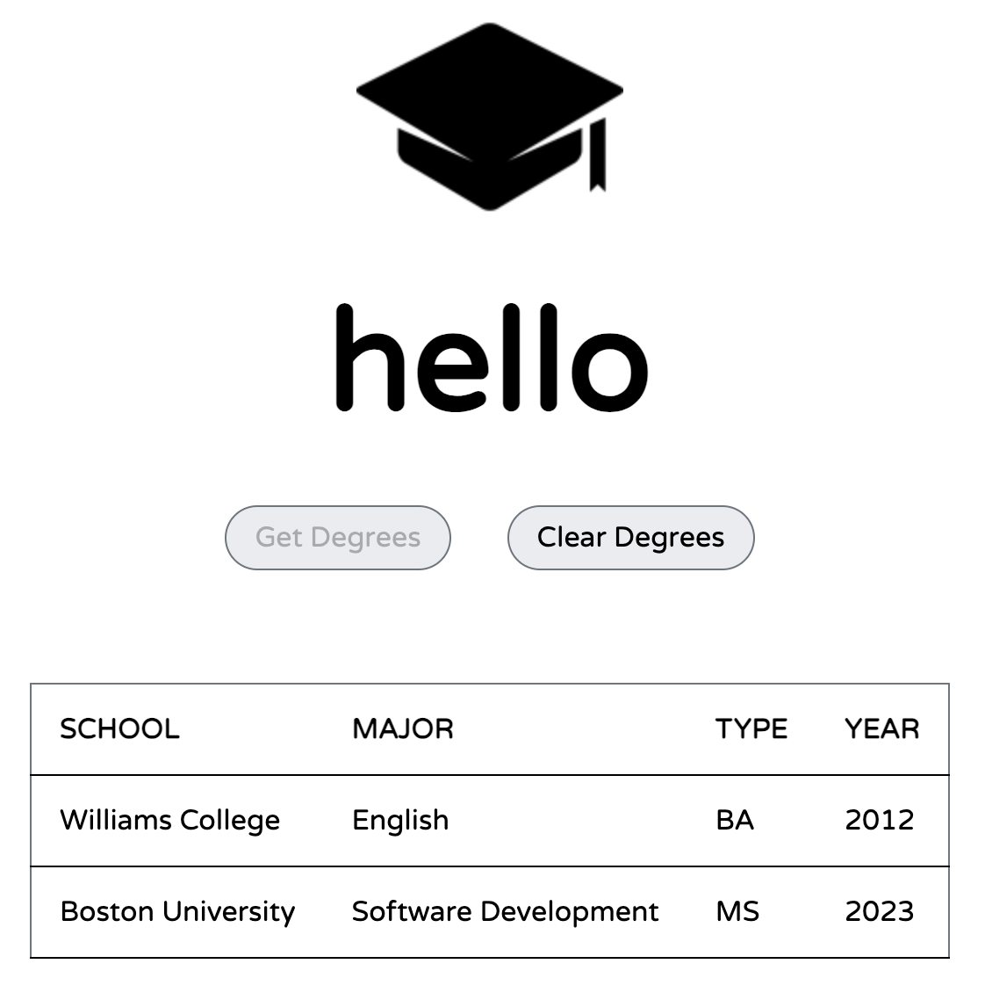

# Degree Fetcher with REST API

Hosted [on Netlify](https://cs601-degrees.netlify.app/)

## Technologies
* HTML
* CSS
* JavaScript/ JSON
* REST API

## Summary
This mini-project fetches JSON data from the degrees.json file using a REST API (hosted on Netlify) and dynamically updates the DOM with a table containing information on degree attainment when the "Get Degrees" button is clicked. Likewise, the "Clear Degrees" button removes the table from the DOM.

*Project inspiration &copy;2021 Boston University*